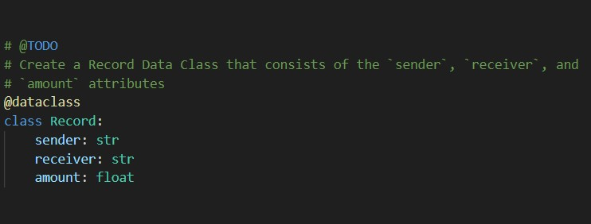

# Module-18 - Scott Speers

# objectives

### 1. Create a new data class named `Record`.

### 2. Modify the existing `Block` class to store the `Record` data.

### 3. Add user inputs to the `Streamlit` interface.

### 4. Test the PyChain Ledger by storing Records.

## Thank you for looking at my assignment
